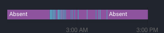

# Automatisations - Routines
{: .no_toc }

Cette section décris les automatisations principales que j'ai configuré dans Home Assistant. Je tâcherai de détailler les parties "velues" autant que possible.

Il est à noter que toutes les automatisations ci-dessous reposent sur la configuration de Home Assistant qui est décrite [ici](/hassio) (les capteurs, les capteurs custom, etc.)


1. TOC
{:toc}


## Notifications quand on arrive à la maison

C'est la toute première automatisation que j'ai mis en place, elle n'apporte pas grand chose mais elle m'a permis de me familiariser avec Home Assistant !

**Pré-requis :**
 - [nmap](https://www.home-assistant.io/integrations/nmap_tracker/) et/ou [owntracks](https://www.home-assistant.io/integrations/owntracks/)
 - home assistant [accessible sur internet](/hassio#accès-depuis-lextérieur)
 - [notifications push](https://www.home-assistant.io/integrations/html5/)
 
Aux débuts pour tracker qui était présent à la maison j'ai utilisé l'intégration [netgear](https://www.home-assistant.io/integrations/netgear/) pour scanner les device sur le réseau domestique et possède l'avantage de gérer les Access Points vu que j'ai deux routeurs à la maison : le problème c'est que Home Assistant récupère bien les device mais la mise à jour ne s'effectuait pas lorsque l'on quittait le réseau.

Donc ensuite j'ai décidé d'utiliser l'intégration [nmap](https://www.home-assistant.io/integrations/nmap_tracker/) pour scanner le réseau régulièrement et savoir quels devices sont connectés ou non au réseau et ainsi savoir si moi et ma conjointe sommes à la maison. Cela a bien fonctionné un temps mais au bout d'un moment, et peu importe les réglages que j'ai pu effectuer, les moments de présence et d'absence n'étaient pas fiable et devenaient intermittent comme suivant :

Ceci est sûrement dû aux smartphones qui coupent le wifi par intermittence pour économiser la batterie.

Au final pour être fiable je cumule :
 - nmap pour tracker les devices au global (routeurs, robot aspirateur, etc.) et pouvoir afficher cela dans le dashboard de [monitoring](/hassio#monitoring)
 - [owntracks](https://www.home-assistant.io/integrations/owntracks/) installé sur les smartphones pour envoyer les changements importants de position GPS à mon instance de home assistant
 
***Fichier automations.yaml***
```yaml
- id: '1569514492243'
  alias: Manon home notification
  trigger:
  - entity_id: person.manon
    from: not_home
    platform: state
    to: home
  condition: []
  action:
  - service: notify.firebase
    data:
      message: Manon est à la maison
      target: OnePlus5_Yann
      data:
        icon: "/local/manon.png"
  - service: system_log.write
    data_template:
      message: 'Manon home notification'
      level: info
    
    
- id: '1569577571785'
  alias: Yann home notification
  trigger:
  - entity_id: person.yann
    from: not_home
    platform: state
    to: home
  condition: []
  action:
  - service: notify.firebase
    data:
      message: Yann est à la maison
      target: OnePlus5t_Manon
      data:
        icon: "/local/yann.jpg"
  - service: system_log.write
    data_template:
      message: 'Yann home notification'
      level: info
```

**Astuces** :
 - il est possible de lier un device ou un profil owntracks sur une entité de type "person" pour pouvoir connaître l'état d'une personne et non d'un device
 - il est possible de notifier directement un device en précisant la target dans le service notify.firebase
 - il est possible d'ajouter des images dans les notifications, le chemin doit être relatif à l'URL publique de votre instance home assistant
 - j'ai mis en place des logs lorsqu'une notification est envoyée pour pouvoir le tracer
 - il est possible de définir des [zones](https://www.home-assistant.io/integrations/zone/) pour pouvoir avoir des états de présence supplémentaires à "home" tel que "travail" ou "famille" mais dans ce cas lorsque vous passez de l'état "travail" à l'état "home" cette automatisation ne fonctionnera pas car vous ne serez pas dans l'état "not_home"

Personnellement j'ai désactivé cette automatisation mais je la conserve en documentation car c'est un bon exemple pour débuter :-)

## Ouverture et fermeture des volets

## Allumer et éteindre le sèche serviette

## Réveil lumineux


***Fichier configuration.yaml***
```yaml
input_boolean:
  wakeup_weekday:
    name: 'Enable wakeup light'
    icon: mdi:power
    initial: off

input_datetime:
  wakeup_weekday_time:
    name: Heure
    has_date: false
    has_time: true
```


***Fichier groups.yaml***
```yaml
wakeup_week_day_panel:
  name: Alarme de semaine
  entities:
    - input_boolean.wakeup_weekday
    - input_datetime.wakeup_weekday_time
```


***Fichier automations.yaml***
```yaml

- id: '1570629369029'
  alias: Bedroom wake-up light
  trigger:
  - platform: time_pattern
    minutes: '/1'
    seconds: 0
  condition:
  - condition: state
    entity_id: person.yann
    state: home
  - condition: time
    weekday:
    - mon
    - tue
    - wed
    - thu
    - fri
  - condition: state
    entity_id: input_boolean.wakeup_weekday
    state: 'on'
  - condition: template
    value_template: '{{ ((as_timestamp(now())|int)|timestamp_custom("%H:%M:00")) == states("input_datetime.wakeup_weekday_time") }}'
  action:
  - service: light.turn_on
    entity_id: light.chambre
    data:
      brightness: 1
  - delay: 00:00:10
  - service: light.turn_on
    data:
      entity_id: light.chambre
      brightness: 100
      transition: 600
    
- id: '1570629959290'
  alias: Bedroom light auto turn off
  trigger:
  - hours: '08'
    minutes: '00'
    platform: time_pattern
    seconds: '00'
  condition:
  - condition: state
    entity_id: person.yann
    state: home
  - condition: time
    weekday:
    - mon
    - tue
    - wed
    - thu
    - fri
  action:
  - data:
      entity_id: light.chambre
    service: light.turn_off

```

## Notification quand il faut sortir les poubelles

