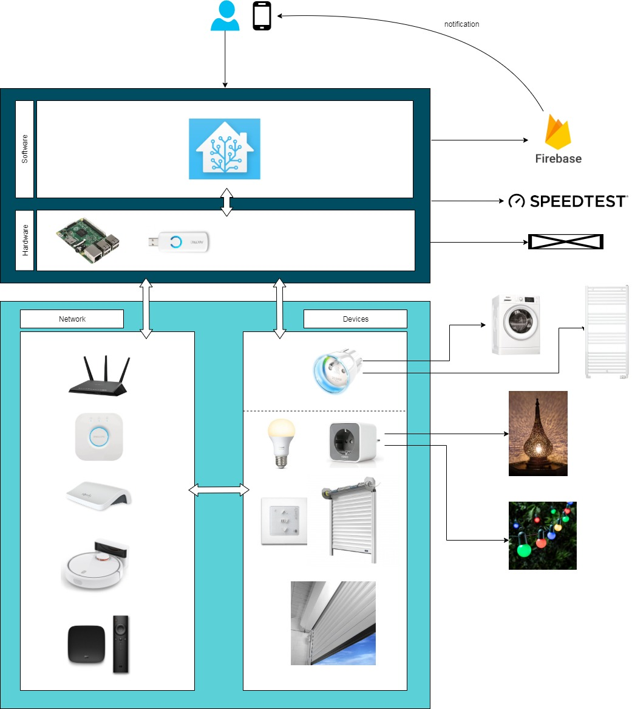

# Mon installation domotique avec Home Assistant

    

Que vous soyez développeur senior ou geek avertis qui n'a jamais souhaité domotiser son domicile ? 

La domotique installée chez moi est historiquement le fruit de quelques années avec l'aggrégation de solutions diverses pour répondre à des besoins dans des contextes et environnements différents. C'est ainsi que j'ai commencé par des lumières connectées avec Philips Hue, système simple à mettre en place et qui ne demande aucun travaux ni maintenance informatique.

Mais cette année, en 2019, j'ai acheté une maison et là ça a changé la donne : la possibilité de faire des travaux facilite certaines installations et la surface de vie imposante a mis en évidence des besoins que je ne possédais jusqu'alors pas vraiment *(e.g. passer de 4 volets au total dans un appartement à 6 volets juste dans le salon forcément une envie d'automatiser certaines choses me titillait !)*.

J'ai donc vu cette maison comme le terrain de jeu idéal pour la domotique et j'ai donc décidé de documenter ici ma solution domotique autour de [Home Assistant](https://www.home-assistant.io) : les automatisations, les configurations, les usages, les astuces, la résilience, les prochains projets, etc.

Les sources de mes configurations et automatisations Home Assistant sont disponibles sur [github](https://github.com/yjajkiew/domotique/tree/master/home-assistant/config).

*J'ai mis en bas de certaines pages la possibilité de laisser des commentaires afin d'échanger et s'entraider au besoin.*

 

**Technologies et composants majeurs** : home assistant, hassio, raspberry pi, philips hue, osram, zigbee, aeotec, z-wave, fibaro, somfy, connexoon

 

## Qui suis-je ?

Le jour je suis architecte de solutions chez Capgemini, travail dans lequel j'aime confronter la technique et les besoins pour concevoir des solutions adaptées, évolutives et scalables.

Les soir  et week-end je fais de la [photographie](https://instagram.com/yann.me), un peu de guitare, je rénove ma maison... et en ce moment vous l'aurez bien compris je m'amuse à la domotiser !

 

## Support / Contact

Site web : [https://yann.me](https://yann.me)

Contact : contact@yann.me



